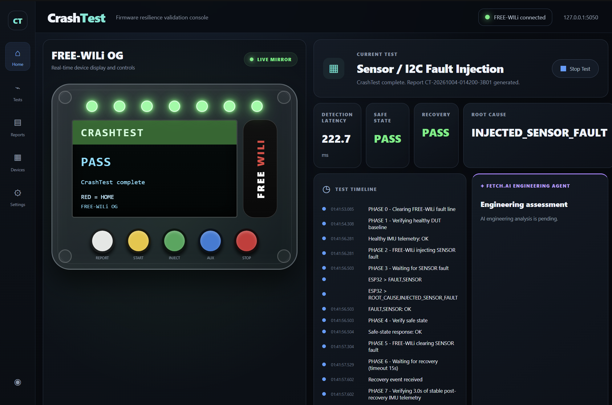
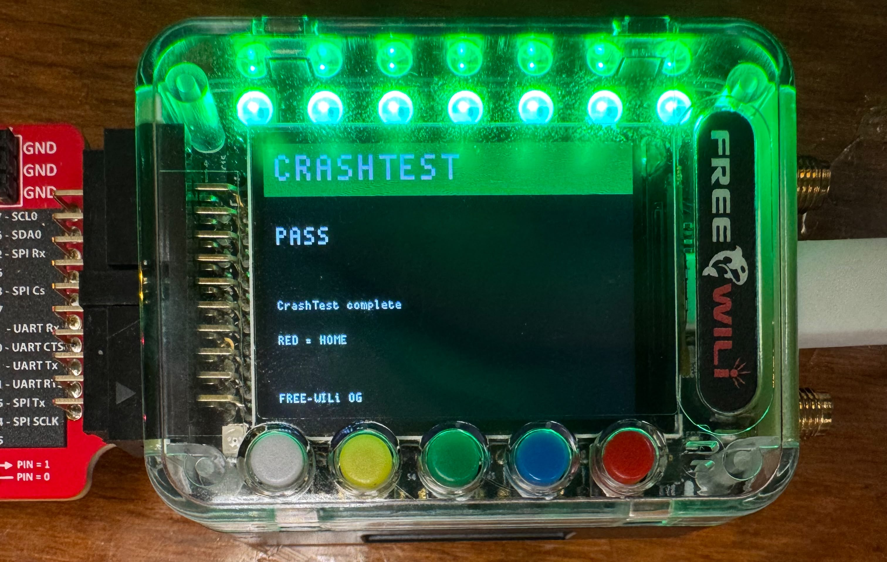
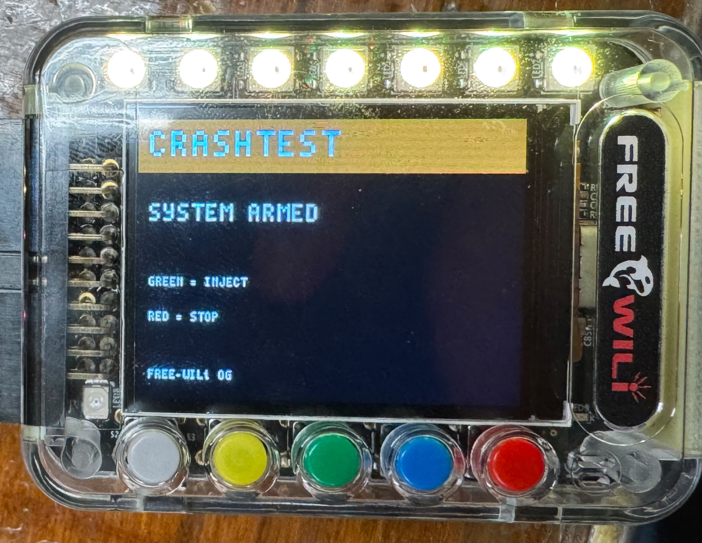
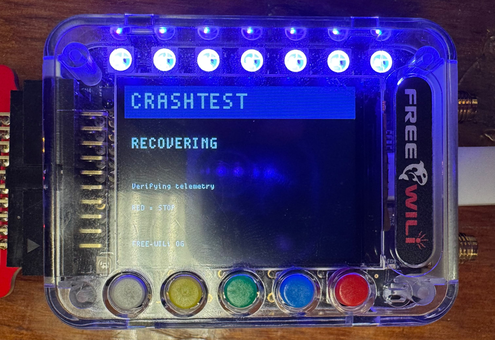
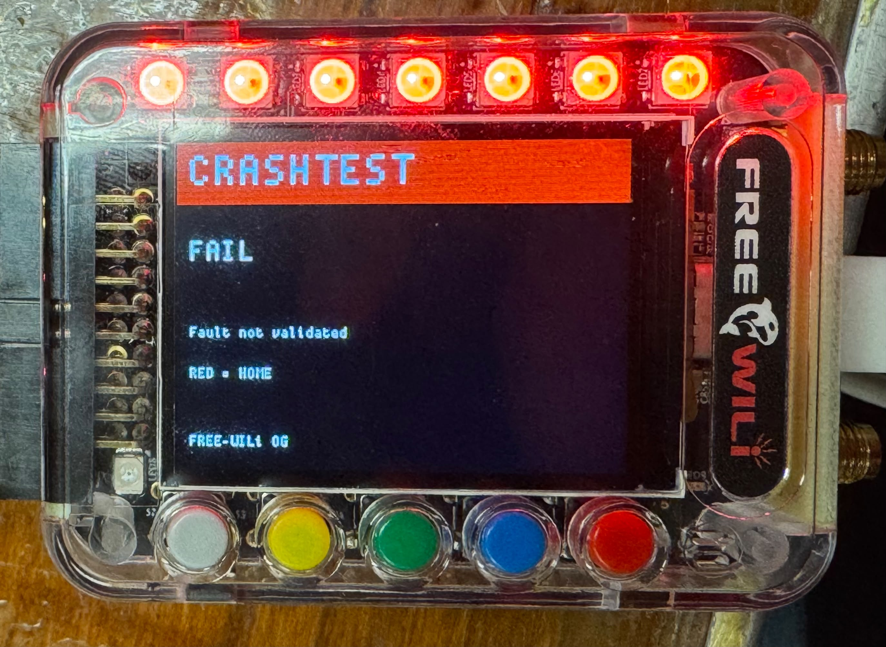
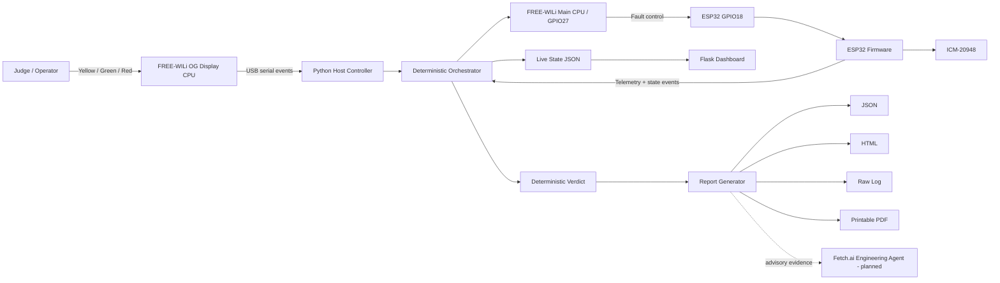
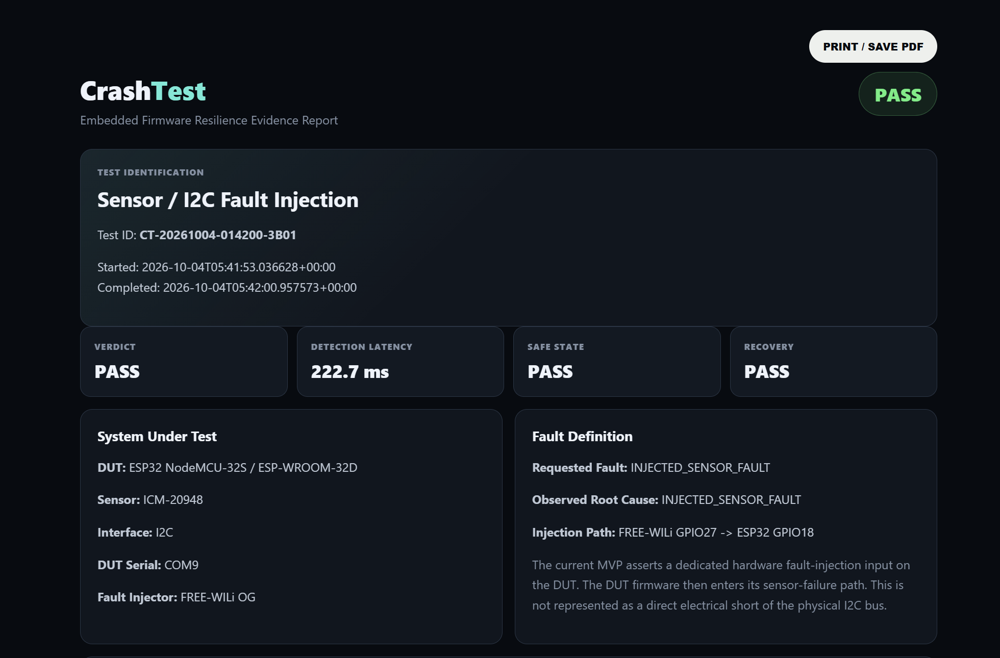

# CrashTest

> **Cars are crash-tested before we trust them. Firmware should be too.**
>
> CrashTest is a hardware-in-the-loop fault-injection and recovery validation platform built around the **FREE-WILi OG**, an **ESP32 DUT**, and a live engineering dashboard. A judge can arm the system, inject a fault from the physical FREE-WILi console, watch the DUT enter a safe state, verify recovery, and open a detailed evidence report - all in one demo.

<p align="center">
  
</p>

## TL;DR

CrashTest deliberately breaks an embedded system, verifies how fast firmware notices, checks whether the device enters a safe state, verifies recovery, and produces an auditable engineering report.

The current MVP validates a sensor-failure path using:

- **FREE-WILi OG** as the physical test console and fault-injection controller
- **ESP32 NodeMCU-32S / ESP-WROOM-32D** as the device under test
- **ICM-20948** IMU as the monitored sensor
- **GPIO27 -> GPIO18** as the current dedicated hardware fault-injection control path
- **Python** as the deterministic orchestrator
- **Flask** as the live dashboard
- **JSON + HTML + raw log + printable PDF workflow** for evidence generation

> [!IMPORTANT]
> **AI never decides PASS/FAIL.** The verdict is produced by deterministic test logic. AI is reserved for explanation, comparison, and recommending the next test.

---

## Why I built it

While building embedded systems, I kept running into a frustrating pattern: the happy path usually worked, but the interesting failures happened when something physical moved, disconnected, stalled, or recovered badly.

During this build, a loose IMU connection made the ESP32 behave intermittently. Sometimes telemetry looked fine. Sometimes the sensor vanished. Sometimes the system recovered. That was a much more realistic failure than a clean software exception, and it exposed a bigger problem: **we usually demo embedded systems when everything is working, but we rarely demo what happens when they fail.**

That became the idea behind CrashTest.

I wanted the judge to be able to walk up to the hardware, press a physical button, intentionally break the system, and watch the firmware prove that it can detect the problem, respond safely, recover, and leave behind evidence of exactly what happened.

CrashTest turns failure from an awkward demo risk into the demo itself.

---

# The problem

Embedded devices increasingly control sensors, actuators, robots, vehicles, industrial equipment, and edge-AI systems. Yet firmware validation often focuses heavily on nominal behavior:

- Does the sensor initialize?
- Does telemetry stream?
- Does the actuator move?
- Does the UI work?

Those questions are necessary, but they do not answer:

- What happens when a sensor disappears?
- How quickly does firmware detect it?
- Does the system enter a safe state?
- Does it recover cleanly?
- Can we prove what happened afterward?

CrashTest is designed around those questions.

---

# What CrashTest does

A complete run looks like this:

```text
Physical FREE-WILi console
        |
        | YELLOW = ARM
        v
System establishes healthy baseline
        |
        | GREEN = INJECT
        v
FREE-WILi asserts fault input
        |
        v
ESP32 detects sensor failure
        |
        v
Firmware reports root cause
        |
        v
Safe-state behavior is validated
        |
        v
Fault is cleared
        |
        v
Firmware retries sensor initialization
        |
        v
Recovery event is validated
        |
        v
Stable post-recovery telemetry window
        |
        v
Deterministic PASS / FAIL
        |
        +--> Live dashboard
        +--> JSON evidence
        +--> HTML engineering report
        +--> Raw serial log
        +--> Printable PDF
```

---

# Hardware experience

The FREE-WILi OG acts like a small embedded validation console rather than a passive development board.

<p align="center">
  
</p>

The physical UI communicates test state directly:

| State | FREE-WILi display | LED behavior |
|---|---|---|
| Ready | `READY` / start prompt | idle color |
| Armed | `SYSTEM ARMED` | armed indication |
| Checking | baseline verification | checking state |
| Injecting | fault injection active | warning state |
| Fault | failure detected | red fault indication |
| Recovering | telemetry recovery verification | blue recovery indication |
| Pass | test complete | green |
| Fail | fault not validated | red |

### Physical controls

| Button | Function |
|---|---|
| **Yellow** | Arm / start a validation run |
| **Green** | Inject the configured fault |
| **Red** | Stop the run / return home |
| **White** | Reserved in the current frozen hardware firmware; the dashboard white control opens the report |
| **Blue** | Reserved for future auxiliary test actions |

## Hardware states

<table>
<tr>
<td align="center"><b>Armed</b><br></td>
<td align="center"><b>Recovering</b><br></td>
</tr>
<tr>
<td align="center"><b>Pass</b><br></td>
<td align="center"><b>Fail</b><br></td>
</tr>
</table>

---

# Architecture



## Why split the system this way?

The project deliberately separates **measurement and verdict logic** from **explanation and UI**.

### Deterministic layer

Responsible for:

- Healthy-baseline validation
- Fault-injection timing
- Fault detection
- Root-cause matching
- Safe-state validation
- Recovery validation
- Post-recovery stability
- Detection latency
- PASS / FAIL

### Presentation / agent layer

Responsible for:

- Dashboard visualization
- Human-readable engineering summaries
- Historical run comparison
- Recommended next tests
- Report presentation

The second layer is not allowed to rewrite the first.

---

# Current fault-injection mechanism

For the MVP, the fault path is:

```text
FREE-WILi GPIO27
        |
        v
ESP32 GPIO18 dedicated fault-injection input
        |
        v
ESP32 firmware enters its sensor-failure path
```

This is intentional and reproducible for the hackathon demo.

> [!NOTE]
> The current implementation **does not claim to electrically short or corrupt the physical I2C bus**. FREE-WILi asserts a dedicated hardware fault-injection input, and the DUT firmware responds by taking the sensor path offline. A future version can add true electrical fault injection using switching hardware.

---

# Device under test

### ESP32

Current DUT:

```text
ESP32 NodeMCU-32S / ESP-WROOM-32D
```

### Sensor

```text
ICM-20948 IMU
I2C address: 0x68
SDA: ESP32 GPIO21
SCL: ESP32 GPIO22
```

### Fault-control input

```text
FREE-WILi GPIO27 -> ESP32 GPIO18
FREE-WILi GND    -> ESP32 GND
```

### Temporary safe-state indicator

```text
ESP32 GPIO17 -> resistor -> LED -> GND
```

---

# Firmware behavior

The ESP32 firmware emits machine-readable events over serial.

Examples:

```text
STATE,HEALTHY
READY
IMU,-973.6,-117.2,48.3
```

Fault event:

```text
FAULT,SENSOR
ROOT_CAUSE,INJECTED_SENSOR_FAULT
SAFE,OK
STATE,FAULT
```

Recovery:

```text
RECOVERY,SENSOR,TRY
STATUS,SENSOR,OK
STATE,HEALTHY
RECOVERY,SENSOR,OK
```

Those events are parsed by the host, but they do **not** automatically mean a test passes. CrashTest applies additional acceptance criteria before generating a PASS.

---

# Deterministic acceptance criteria

A sensor-fault run currently passes only if all of the following are true:

1. The DUT produces a stable healthy IMU baseline before fault injection.
2. FREE-WILi asserts the configured fault.
3. The DUT reports a sensor failure.
4. The reported root cause matches `INJECTED_SENSOR_FAULT`.
5. The DUT confirms `SAFE,OK`.
6. FREE-WILi clears the fault.
7. Recovery completes within the configured timeout.
8. Real IMU telemetry remains stable after recovery for the verification window.

A firmware-generated `RECOVERY,SENSOR,OK` message by itself is not enough. CrashTest also requires sustained telemetry afterward.

---

# Example successful run

A completed example validation produced:

```text
TEST             : SENSOR / I2C FAILURE
ROOT CAUSE       : INJECTED_SENSOR_FAULT
SAFE STATE       : PASS
RECOVERY         : PASS
DETECTION LATENCY: 222.7 ms
FINAL VERDICT    : PASS
```

The same run captured **32 post-recovery IMU samples** during the stability verification window.

[**Open the full sample engineering report (PDF)**](docs/sample-report.pdf)

---

# Live dashboard

The dashboard mirrors the physical FREE-WILi experience instead of behaving like a generic monitoring page.

It includes:

- A virtual FREE-WILi with seven top LEDs
- Virtual white / yellow / green / blue / red buttons
- Mirrored physical button presses for the currently exposed hardware events
- LCD state matching the physical console
- Live test phase
- Detection latency
- Safe-state result
- Recovery result
- Root cause
- Detailed event timeline
- Recent validation history
- Engineering-report access
- Reserved Fetch.ai engineering-agent panel

<p align="center">
  
</p>


# Engineering report generation

Every completed run can generate an evidence package containing:

- Unique test ID
- Start and completion timestamps
- DUT configuration
- Sensor and interface
- Fault-injection path
- Requested fault
- Observed root cause
- Deterministic verdict
- Detection latency
- Safe-state result
- Recovery result
- Acceptance criteria
- Test timeline
- Risk assessment
- Recommended next actions
- Captured serial evidence
- SHA-256 evidence digest
- Raw console log

<p align="center">
  
</p>

The HTML report includes a **PRINT / SAVE PDF** action so a completed run can immediately become a portable engineering artifact.

## Evidence integrity

The report generator creates a SHA-256 digest from deterministic test identity, verdict, measurements, and timeline. This is not intended to be a cryptographic attestation system yet, but it gives the evidence package a stable integrity marker and provides a path toward signed reports later.

---

# Fetch.ai agent direction

The project is designed for a `CrashTest Engineer Agent` that consumes the deterministic evidence package after a run.

Planned agent tools:

```text
get_latest_test()
get_test(test_id)
get_recent_tests()
compare_runs()
analyze_failure()
recommend_next_test()
generate_engineering_summary()
```

The agent will be able to answer questions such as:

```text
Why did the last run fail?

Compare the last five detection latencies.

What should I test next?

Did this firmware recover consistently?
```

### Current status

The deterministic test engine, dashboard, report generator, and evidence package are working. The Fetch.ai panel and report section are currently reserved for agent integration; they should not be interpreted as a completed Agentverse deployment yet.

---

# Software stack

| Layer | Technology |
|---|---|
| FREE-WILi display firmware | C / Pico SDK / FREE-WILi OG BSP |
| FREE-WILi main control | `bench_main` + modern OG BSP tools |
| DUT firmware | Arduino C++ / ESP32 |
| Sensor | SparkFun `ICM_20948` library |
| Host orchestration | Python 3 |
| Serial communication | `pyserial` |
| Dashboard | Flask + HTML + CSS + JavaScript |
| Report engine | Python + HTML |
| Evidence | JSON + `.log` + HTML + PDF workflow |
| Agent layer | Fetch.ai / Agentverse / ASI:One - planned |

---

# Repository structure

```text
CrashTest/
|
|-- README.md
|-- PROTOCOL.md
|-- requirements.txt
|
|-- config/
|   `-- ports.example.json
|
|-- dashboard/
|   |-- app.py
|   |-- templates/
|   |   `-- index.html
|   `-- static/
|
|-- docs/
|   |-- images/
|   |   |-- hardware-pass.jpeg
|   |   |-- hardware-fail.jpeg
|   |   |-- hardware-armed.jpeg
|   |   |-- hardware-recovering.jpeg
|   |   |-- dashboard-pass.png
|   |   `-- report-overview.png
|   `-- sample-report.pdf
|
|-- firmware/
|   `-- single_node_mvp/
|       `-- single_node_mvp.ino
|
|-- freewili/
|   `-- README.md
|
|-- host/
|   |-- freewili_bridge.py
|   |-- orchestrator.py
|   |-- crashtest_ui.py
|   |-- run_and_report.py
|   |-- report.py
|   `-- diagnosis.py
|
|-- logs/
|-- reports/
`-- demo/
```

---

# Running CrashTest

## 1. Install Python dependencies

```powershell
py -m pip install Flask pyserial requests
```

## 2. Start the dashboard

```powershell
cd C:\Users\schug\Desktop\CrashTest
py .\dashboard\app.py
```

Dashboard:

```text
http://127.0.0.1:5050
```

## 3. Start the FREE-WILi / ESP32 controller

In a second PowerShell:

```powershell
cd C:\Users\schug\Desktop\CrashTest
py .\host\crashtest_ui.py --esp-port COM9 --panel-port COM6
```

Current development ports:

```text
FREE-WILi main:    COM5
FREE-WILi display: COM6
ESP32 DUT:         COM9
```

Ports should be treated as configurable values rather than permanent assumptions.

---

# Demo flow

A fast judge demo takes roughly one minute:

### 1. Show the dashboard

Explain that the browser is a live mirror of the hardware console.

### 2. Press YELLOW on FREE-WILi

```text
SYSTEM ARMED
GREEN = INJECT
RED = STOP
```

The dashboard mirrors the state.

### 3. Press GREEN

CrashTest verifies the healthy DUT baseline before injecting anything.

### 4. FREE-WILi injects the fault

The dashboard progresses through:

```text
CHECKING
HEALTHY
INJECTING
FAULT
RECOVERING
PASS / FAIL
```

### 5. Show the deterministic verdict

Point out latency, root cause, safe-state validation, and recovery.

### 6. Open the report

Use the white report control in the dashboard and show the evidence timeline and raw data.

### 7. Optional failure demo

Break the sensor path before the test and demonstrate that CrashTest refuses to issue a false PASS because it cannot establish the required baseline.

---

# Design decisions

## Why use a dedicated fault input first?

True bus-level fault injection is valuable, but it adds switching hardware, bus loading concerns, and additional failure modes to a 24-hour build. The dedicated fault input gave the project a repeatable hardware-triggered fault path while preserving a clean migration path to real electrical injection later.

## Why require a healthy baseline?

Without a verified baseline, a system that is already broken could appear to "pass" simply because the orchestrator sees a fault event. CrashTest therefore refuses to test until the DUT proves that it is healthy first.

## Why verify telemetry after recovery?

A firmware message saying `RECOVERY,SENSOR,OK` is not enough. The host requires real post-recovery IMU frames for a configured stability interval. That prevents a false PASS when firmware claims recovery but the sensor immediately fails again.

## Why keep AI out of the verdict?

Reliability testing should be explainable and reproducible. A language model is useful for summarizing evidence and planning subsequent tests, but not for deciding whether a measured acceptance criterion was met.

---

# Known limitations

The current MVP is intentionally narrow and honest about its boundaries:

- The present sensor fault is triggered through a dedicated fault-injection GPIO, not a direct electrical I2C fault.
- Only one DUT is used in the current hardware demo.
- The main validated fault class is sensor communication failure.
- The temporary LED safe-state indicator does not provide closed-loop electrical feedback.
- Serial ports are still passed explicitly in the development workflow.
- Fetch.ai agent integration is planned but not yet the source of report analysis.
- The HTML report uses the browser print pipeline for PDF export.

These are roadmap items, not hidden assumptions.

---

# Roadmap

### More fault classes

- True I2C SDA/SCL stuck-low injection
- Sensor power interruption
- UART framing / communication faults
- Actuator disconnect
- Watchdog resets
- Brownout / power interruption
- Timing faults
- Stuck-high / stuck-low digital inputs

### Better hardware fault injection

- Analog switches / bus switches
- Load switches
- Relay or MOSFET-controlled sensor power
- Programmable fault matrix
- Multi-DUT support

### Automation

- Batch 10 / 100 cycle stress testing
- Latency distributions
- Recovery-time distributions
- Regression baselines
- Firmware-version comparison

### Agent layer

- Fetch.ai Agentverse registration
- ASI:One discovery
- Agent Chat Protocol
- Tool-driven report analysis
- Historical comparison
- Recommended next-test planning

### Evidence

- Signed reports
- Test configuration manifests
- Firmware commit hashes
- Hardware revision tracking
- Exportable CSV metrics

---

# Why this matters

CrashTest is not trying to replace a full hardware validation lab in one weekend.

It demonstrates a workflow:

> **Make failure intentional. Measure the response. Verify safety. Verify recovery. Save the evidence.**

That workflow can scale from a single ESP32 sensor demo to robotics, automotive electronics, industrial controllers, edge-AI devices, and production hardware validation.

The long-term vision is a compact test appliance where an engineer connects a target, describes the expected behavior, selects a failure mode, and CrashTest repeatedly proves whether the firmware is actually resilient.

---

# Sample report

A complete sample report from a successful run is included here:

**[docs/sample-report.pdf](docs/sample-report.pdf)**

It includes the deterministic result, system configuration, fault definition, test timeline, acceptance criteria, risk assessment, recommended next actions, captured evidence, and evidence-integrity digest.

---

# Screenshots and media included in this repository

The README intentionally references only assets that are present under `docs/images/`:

```text
dashboard-pass.png
hardware-armed.jpeg
hardware-fail.jpeg
hardware-pass.jpeg
hardware-recovering.jpeg
report-overview.png
```

These files cover the physical FREE-WILi states, the completed PASS dashboard, and the generated engineering report.

---

# Built with

- FREE-WILi OG
- Raspberry Pi Pico SDK / FREE-WILi OG BSP
- ESP32
- ICM-20948
- Python
- Flask
- JavaScript
- HTML / CSS
- Serial protocols
- Hardware-in-the-loop testing

---

## CrashTest

**Break it on purpose. Prove that it survives.**
